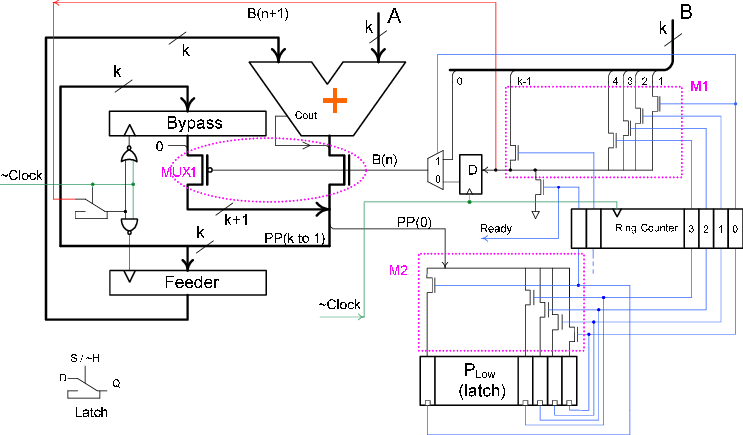

# BZ-FAD: A Low-Power Low-Area Multiplier based on Shift-and-Add Architecture
BZ-FAD (ByZ-FAD) stands for "**By**pass **Z**ero, **F**eed **A** **D**irectly" and was published in 2009 in [IEEE TVLSI](https://ieeexplore.ieee.org/document/4745811). It is the name of a shift-and-add multiplier architecture that has considerably lower switching activity compared to conventional shift-and-add multipliers. The modifications to the multiplier that multiplies A by B include removing the B-register shift, direct feeding of A to the adder, bypassing the adder whenever possible, using a ring counter instead of a binary counter, and removing the partial-product shift. Moreover, to further reduce the multiplication switching activity, BZ-FAD uses a [Hot Block Ring Counter](https://ieeexplore.ieee.org/document/4243647), which is a special clock-gated low-power ring counter. 

Simulation results for 32-bit radix-2 multipliers show that the BZ-FAD architecture lowers the total switching activity by up to 76% and the power consumption by up to 30% when compared to the conventional architecture. The proposed multiplier can suitably be used for low-power applications where speed is not a primary design concern.
  
### BZ Fad Architecture

### Notes
* **Paper**: The original article (in PDF) is available in this repository and also here: http://www.mpedram.com/Papers/BZFAD-tvlsi08.pdf

* BZ-FAD has also been referred to as ByZFAD, or BZFAD.

